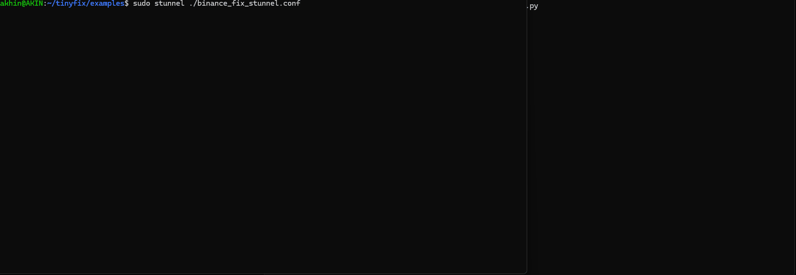

[](https://opensource.org/licenses/MIT)


# tinyfix

* [Intro](#intro)
* [Installation](#installation)
* [Writing a minimal FIX client](#minimal-client)
* [Writing a minimal FIX server](#minimal-server)
* [SSL/TLS and Binance example](#ssl-binance)
* [Session settings](#session-settings)
* [Repeating groups](#repeating-groups)
* [Setting header and trailer tags](#header-trailer)
* [Limitations](#limitations)

<a name="intro"></a>
## Intro

tinyfix is a minimal FIX protocol library for standard Python 3, designed for building FIX-based tools and prototyping FIX server and client applications.

The library intentionally avoids administrative message handling and message validation. This gives you full control to craft and manipulate FIX messages freely. It does not require FIX dictionaries and is version-agnostic, allowing it to operate with any FIX version.

The API surface is deliberately minimal, providing only a small set of core methods such as set_tag and get_tag_value. This eliminates the need to learn complex or version-specific APIs and allows you to focus entirely on your workflow.

Because it targets stock Python (v3), it works out of the box on most Linux distributions without additional dependencies.

<a name="installation"></a>
## Installation

Installing locally :

```bash
pip install --user -e <tinyfix_folder>
```

Uninstalling locally :

```bash
pip uninstall tinyfix
```

<a name="minimal-client"></a>
## Writing a minimal FIX client

You can find the below example in the examples directory:

```python
import time
import signal
from tinyfix import *

IS_EXITING = False

class MyClientHandler(FixClientHandler):
    def handle(self):
        while not IS_EXITING:
            if self.fix_session.state == SessionState.DISCONNECTED:
                self.connect(5)

                if self.fix_session.state == SessionState.PENDING_LOGON:
                    self.send_logon()
            else:
                self.send_heartbeat_if_necessary()

                current_msg = self.get_next_fix_message()

                if current_msg is None:
                    continue

                print("Received: " + current_msg.to_string() + "\n")
                msg_type = current_msg.get_tag_value(35)

                if msg_type == "A":
                    self.fix_session.state = SessionState.LOGGED_ON
                    print("Logon accepted.\n")

    def on_disconnection(self):
        print("Connection lost\n")

    def send_logon(self):
        logon = FixMessage()
        logon.set_msg_type("A")
        logon.set_tag(141, "Y")
        logon.set_tag(1137, "7")
        logon.set_tag(98, "0")
        logon.set_tag(108, str(self.fix_session.heartbeat_interval))

        self.send(logon)
        print("Sent logon : " + logon.to_string() + "\n")

    def send_heartbeat_if_necessary(self):
        if self.fix_session.last_sent_time is not None:
            if time.time() - self.fix_session.last_sent_time >= self.fix_session.heartbeat_interval:
                hb = FixMessage()
                hb.set_msg_type("0")

                self.send(hb)
                print("Sent Heartbeat.\n")

def signal_handler(signal, frame):
        global IS_EXITING
        IS_EXITING = True

def main():
    try:
        signal.signal(signal.SIGINT, signal_handler)

        # FIX SESSION
        fix_session = FixSession()
        fix_session.begin_string = "FIXT.1.1"
        fix_session.comp_id = "CLIENT1"
        fix_session.target_comp_id = "EXECUTOR"
        fix_session.endpoint_address = "127.0.0.1"
        fix_session.port = 5001
        #fix_session.bind_address="YOUR_NIC_ADDRESS"

        # FIX CLIENT
        client = FixClient(fix_session, MyClientHandler)
        client.start()

        while True:
            if IS_EXITING is True:
                break
            time.sleep(1)
        
        client.stop()

    except ValueError as err:
        print(err.args)

#Entry point
if __name__ == "__main__":
    main()
```

<a name="minimal-server"></a>
## Writing a minimal FIX server

You can find the below example in the examples directory:

```python
import time
import signal
from tinyfix import *

IS_EXITING = False

class MyFixServerHandler(FixServerHandler):
    def handle(self):
        while not IS_EXITING:
            current_msg = self.get_next_fix_message()

            if current_msg is not None:
                if self.server.supports_client_session(current_msg):

                    if current_msg.get_tag_value(35) == "A":
                        self.initialise_session_from_logon_message(current_msg)

                        print("Logon received : " + current_msg.to_string() + "\n")

                        logon_response = FixMessage()
                        logon_response.set_msg_type("A")

                        self.send(logon_response)

                        print("Sent logon response : " + logon_response.to_string() + "\n")

                    if current_msg.get_tag_value(35) == "0":

                        print("Client heartbeat received\n")

                        heartbeat_response = FixMessage()
                        heartbeat_response.set_msg_type("0")

                        self.send(heartbeat_response)

                        print("Sent heartbeat response : " + heartbeat_response.to_string() + "\n")

    def on_disconnection(self):
        print("Connection lost\n")

def signal_handler(signal, frame):
        global IS_EXITING
        IS_EXITING = True

def main():
    try:
        signal.signal(signal.SIGINT, signal_handler)

        # FIX SESSIONS
        session1 = FixSession()
        session1.begin_string = "FIXT.1.1"
        session1.comp_id = "EXECUTOR"
        session1.target_comp_id = "CLIENT1"

        session2 = FixSession()
        session2.begin_string = "FIXT.1.1"
        session2.comp_id = "EXECUTOR"
        session2.target_comp_id = "CLIENT2"

        # FIX SERVER
        port_number = 5001
        server = FixServer(('127.0.0.1', port_number), MyFixServerHandler)
        server.add_client_fix_session(session1)
        server.add_client_fix_session(session2)
        server.start()

        while True:
            if IS_EXITING is True:
                break
            time.sleep(1)

        server.stop()

    except ValueError as err:
        print(err.args)

#Entry point
if __name__ == "__main__":
    main()
```

<a name="ssl-binance"></a>
## SSL/TLS and Binance example

tinyfix does not support SSL/TLS. However it can be used with stunnel.

A working Binance Spot Testnet example is available in the examples directory (binance_client.py). As for prerequisites:
- python -m pip install cryptography
- Install stunnel. ( On Ubuntu/Debian : sudo apt install stunnel4 )

The example is for Binance exchange's testnet environment. Therefore you will need to create your own keys:
1. Generate key :
```bash
openssl genpkey -algorithm ed25519 -out ed25519_private.pem
openssl pkey -in ed25519_private.pem -pubout -out ed25519_public.pem
```
2. Visit https://testnet.binance.vision/. And authenticate with your Github account
3. Register your public key on https://testnet.binance.vision/ and note your API key.
4. Copy ed25519_private.pem to examples directory by overwriting the placeholder.
5. Edit binance_client.py and set your API key : API_KEY = "PLACE_YOUR_API_KEY_HERE"

To try, first start stunnel in one terminal:
```bash
cd examples
sudo stunnel binance_fix_stunnel.conf
```
Then, in another terminal, run the client:
```bash
cd examples
sudo python3 ./binance_client.py
```

The following recording shows a TLS connection (via stunnel) and FIX messages (logon, Binance custom messages, heartbeats and logout) sent to and received from the Binance Testnet :



<a name="session-settings"></a>
## Session settings

For each client or server session, you have to set 3 options :

- begin_string : One of : FIX.4.0, FIX.4.1, FIX.4.2, FIX.4.3, FIX.4.4, FIXT.1.1
- comp_id
- target_comp_id

For client session you also have to set :

- endpoint_address
- port

Similarly for server sessions, you have to set :

- bind_address
- port

Other session configs you can use are :

| Property | Description |
|-----------|-------------|
| timestamp_subsecond_precision | Specifies the subsecond precision used in the tag 52 (SendingTime) header field. Its type is `TimestampSubsecondPrecision`. Enum values are `NANO`, `MILLI`, `MICRO`, and `NONE`. The default value is `NANO`. |
| receive_size | Specifies the number of bytes a client or server will attempt to receive in each socket call. |
| state | Its type is the `SessionState` enum. Possible values are `DISCONNECTED`, `PENDING_CONNECTION`, `PENDING_LOGON`, `PENDING_LOGOUT`, `LOGGED_ON`, `LOGGED_OUT`, `LOGON_REJECTED`, `IN_RETRANSMISSION_INITIATED_BY_SELF`, and `IN_RETRANSMISSION_INITIATED_BY_PEER`. |
| last_sent_time | Set automatically by tinyfix. |
| last_received_time | Set automatically by tinyfix. |
| incoming_seq_no | Set automatically by tinyfix. Can also be modified programmatically if required. |
| outgoing_seq_no | Set automatically by tinyfix. Can also be modified programmatically if required. |
| heartbeat_interval | Not used internally by tinyfix. Can be used to store the heartbeat interval value when implementing heartbeat messages (as shown in the `minimal_client` example). |

<a name="repeating-groups"></a>
## Repeating groups

To encode, you need to call the set_tag api. tinyfix internally stores tag value pairs in an array. Therefore it allows same tag values already :

```python
message = FixMessage()
message.set_tag(453, "2")
message.set_tag(448, "PARTY1")
message.set_tag(447, "D")
message.set_tag(452, "1")
message.set_tag(448, "PARTY2")
message.set_tag(447, "D")
message.set_tag(452, "3")
```

To decode, you need to use get_repeating_tag_value method. Its first arg specifies the tag no and its second arg specifies the 0-based index of tag-value pair in the incoming message :

```python
group_count = incoming_message.get_repeating_tag_value(453, 0)
first_448= incoming_message.get_repeating_tag_value(448, 0)
second_448= incoming_message.get_repeating_tag_value(448, 1)
```

You can also check binance_client.py example in the examples directory for a repeating group parsing example.

<a name="header-trailer"></a>
## Setting header and trailer tags

tinyfix will encode t8,t9,t35,t49,t52,t56 to the beginning all outgoing messages. It will also add t10/checksum to the end of messages. To include additional header or trailer tags, call the set_tag method in the exact order you want them to appear in the output message.

You can also check binance_client.py example in the examples directory for setting custom header tags.

<a name="limitations"></a>
## Limitations

**Decoding binary fields**

tinyfix operates on raw bytes at the transport level and can send FIX messages containing binary fields such as tag 95 (RawDataLength) and tag 96 (RawData).  

However, during decoding tinyfix does not interpret binary length fields (for example, tag 95 determining the exact byte length of tag 96), and does not apply special parsing rules for embedded SOH characters inside binary payloads.